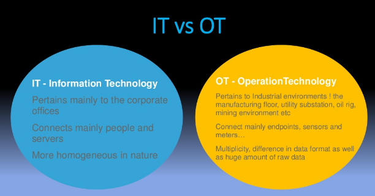

# 工业互联网 （工业4.0）

> 工业互联网涉及到的行业知识非常丰富。对于想要从事工业互联网的开发者来说，如果来开始学习工业互联网是一个非常具有挑战的问题。
>
> 因为本人也是刚刚进入工业互联网，这个项目主要是学习和实践中的一些总结。所以有很多不晚上的地方。有任何建议和意见都可以通过issue或者pull request来贡献。也可以直接发送邮件到soolaugust@gmail.com来进行讨论。

- [工业互联网 （工业4.0）](#工业互联网-工业40)
  - [基本概念](#基本概念)
    - [IT & OT](#it--ot)
  - [协议](#协议)
    - [OPC UA](#opc-ua)
    - [TSN](#tsn)
  - [文章](#文章)
  - [平台调研](#平台调研)
  - [大数据相关](#大数据相关)
  - [其他](#其他)
    - [公众号](#公众号)

## 基本概念

### IT & OT

IT (Information Technology)，即信息技术，是用于管理和处理信息所采用的各种技术总称，主要是应用计算机科学和通信技术来设计、开发、安装和实施信息系统及应用软件。

OT (Operational Technology)，指操作技术，是工厂内的自动化控制系统操作专员为自动化控制系统提供支持，确保生产正常进行的专业技术。

IT/OT的融合是近几年的热点，其大致意思是通过打通制造执行系统与运营管理系统之间的数据链路，并将二者整合在一个统一的信息平台上，从而帮助企业提升在生产管理、运营决策与制造执行等各方面的综合效益。但知难行易，将OT与IT融合并不是一件容易的事情，制造企业除了需要面对跨界投入不稳定、不确定的风险以及设备、专业IT人力等成本的挑战外，IT与OT本身的特性也为二者融合设置了障碍。

## 协议

### OPC UA

* [OPC UA协议](docs/protocols/opc_ua_guide.md)

### TSN

* [TSN时间敏感网络协议](docs/protocols/tsn.md)

## 文章

* [数据模型设计](docs/articles/ibm_iot.md)

## 平台调研

* [阿里云物联网平台](docs/platforms/aliyun_iot_platform)

## 大数据相关

* [工业大数据](docs/big-data/reference.md)

## 其他

### 公众号

如果大家想要实时关注我更新的文章和其他的分享，可以关注我的公众号"yuye_suibi"。

