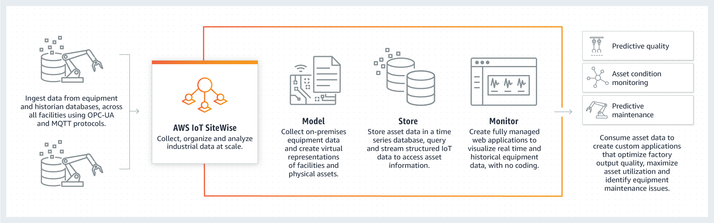

# AWS IoT SiteWise设计解析

> 官网：[https://amazonaws-china.com/cn/iot-sitewise/?c=i&sec=srv](https://amazonaws-china.com/cn/iot-sitewise/?c=i&sec=srv)

事实上我们在设计工业物联网时，有时可能并不需要一个完成的平台来处理设备的管理或者和云端的交互，或者说我们需要一个更为轻量级或者单体式的应用来处理我们的数据和设备监控。

基于此，AWS设计了另外一套数据采集组件IoT SiteWise。这个设计目的在官网中也有体现：

> **从工业设备中轻松地大规模收集、组织与分析数据**

## 面临的挑战

从工业设备中获取性能指标非常困难，因为数据通常被锁定在专有的本地数据存储中，且通常需要专业知识来检索数据并将其转换为有助于分析的格式。所以数据搜集第一个面临的挑战是如何一致性收集。

另一个就是数据的利用，除了提供给上层程序，更多时候我们需要直接能够看到我们搜集到的数据，并且如果可以监控数据来发现问题。

基于这种基本需求，IoT SiteWise分析出了下面的特点：

* 从所有来源一致地收集数据
* 通过远程监控快速识别问题
* 使用中心数据源改进跨设施流程

所以在设计上，IoT SiteWise内置了需要的数据收集、管理与可视化功能。来帮助采集和管理数据。