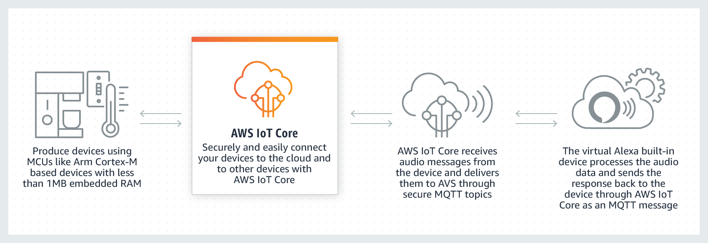

# AWS IoT Core设计解析

> 官网：[https://amazonaws-china.com/cn/iot-core/?c=i&sec=srv](https://amazonaws-china.com/cn/iot-core/?c=i&sec=srv)

AWS IoT Core是AWS IoT云端设计的核心业务，在设计时明确了其目的：

> **轻松安全地将设备连接到云。可靠地扩展至数十亿台设备以及数万亿条消息。**

IoT Core面临的场景就是如何将设备更好的连接到云端。基于这个目的拓展了以下的设计要求：

* **轻松连接**：因为设备端的复杂性和性能要求，如何让设备端以最小的代价连接云端是云端设计的基本要求
* **安全连接**：这个也是设计上需要重点考虑的，物联网连接无论如何设计，安全都是首要的设计目的，特别是连接云端后，如何保证设备的安全运行是云端设计的重要内容
* **可靠性**：云端连接面临着众多设备和应用的交互，可靠性是需要重点保证的
* **可拓展性**：这个需求来源于设备端的复杂性和物联网技术的更新迭代速度

## 轻松连接

AWT IoT Core为了保证设备能够轻松连接，支持了多种通信协议，包括带宽和资源占用低的MQTT等协议。同时支持多种行业标准和自定义协议，保证设备即使使用不同的协议也能相互通信。

## 安全连接

AWT IoT Core为了保证设备连接和通信数据的安全，在设计上采用首次连接提供自动配置，身份验证和端到端加密。保证在没有验证身份的情况下，不会进行任何的数据交换。

同时为上层应用提供权限配置的接口来进一步保护设备和数据。

## 数据处理

数据处理是云端的基本功能，IoT Core在设计上增加了规则引擎，这个也是自动化和报警等功能的基础。通过规则引擎，应用可以筛选和转换设备数据并执行操作。

同时集成了上层的IoT Cloud服务，来提供更为强大的功能，之所以将这些服务外包而不是集成在IoT Core中，一方面是为了保证IoT Core的业务清晰，是架构设计中的范围划定的考虑。另一方面是因为这些服务是会不断增加的，而且不是每一个云端或设备都必须的，也就是可以灵活配置的，所以独立处理啊更为合理。

## 设备影子

设备影子或类似的概念是所有云端设计的核心工业，也是物联网架构中的重要内容，其来源是因为设备端的不可靠性，无论是设备本身还是与设备的连接，那么如果上层应用直接操作真实设备，那么就会有很多不可知的情况发生。所以一般都会在中间抽象一层，在IoT Core中也就是设备影子。通过这一层，屏蔽了设备端的不可靠情况，保证上层应用的访问。通过同步来保证设备影子的更改都会反应到真是设备中，也能保证真实设备和设备影子状态同步。

## 设备能力抽象

AWS IoT Core设计中的一大亮点就是设备能力的抽象，比如虚拟AVS服务，使得音频的处理能力放置到云端，这样设备的成本就会很低，只需要处理音频的输入和输出。这是一种设备计算能力的云端抽象化。

## 总结

AWS IoT Core在设计上基于让设备轻松安全连接的目的，在架构上保持Core核心业务的独立性，其他云端服务通过集成的方式来配置。并通过设备影子的方式屏蔽了下层设备的不可靠性。有亮点的是设备能力的抽象，从而解放了设备的计算能力，让设备的成本可以更低，同时计算资源也更为可控。事实上对于边缘端的设备也可以参考这一点，将计算能力外置到云端或者边缘端。