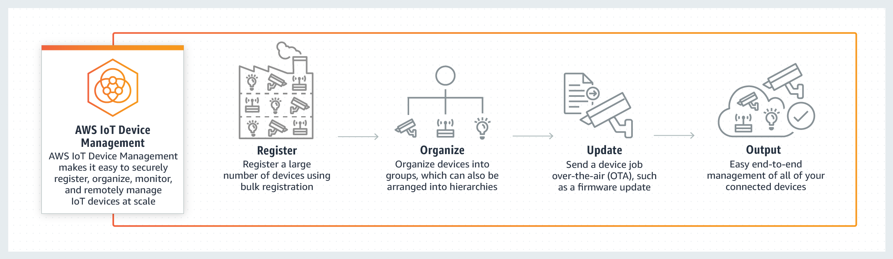

# AWS IoT Device Management设计解析

> 官网：[https://amazonaws-china.com/cn/iot-device-management/?c=i&sec=srv](https://amazonaws-china.com/cn/iot-device-management/?c=i&sec=srv)

在工业物联网架构设计中，我们除了考虑设备和云端的交互，还要考虑设备的规模，许多 IoT 部署由几十万至数百万台设备组成。所以AWS在云端设计上增加了IoT Device Management组件。其目的在官网中也进行了说明：

> **大规模注册、组织、监控和远程管理互联设备**

IoT Device Management这个组件并不属于必需组件，但是在工业物联网中却是不可缺少的一环。大规模的设备管理包括设备的注册，管理。所以继续拆分需求，AWS将大规模设备需求分析如下：

* 快速注册设备
* 简单的 IoT 设备组织
* 快速定位连接的设备
* 轻松进行远程设备管理

在设计上，IoT Device Management采用插件式的设计，和IoT Core和IoT Device Defender协同工作，完成设备的注册，管理，配置下发，推送更新等功能。