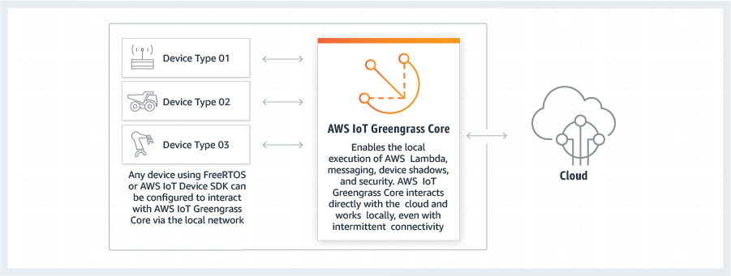
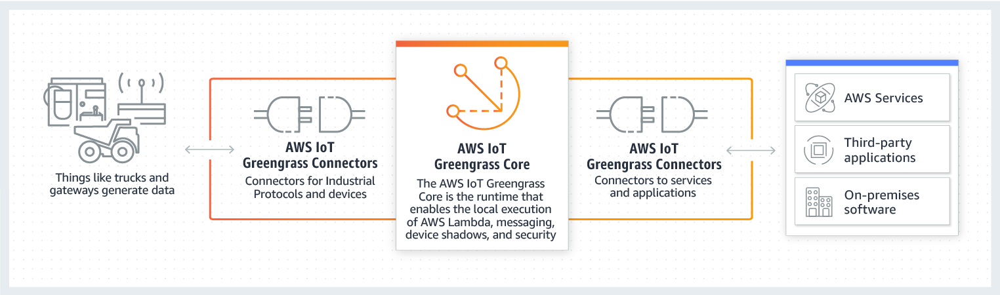
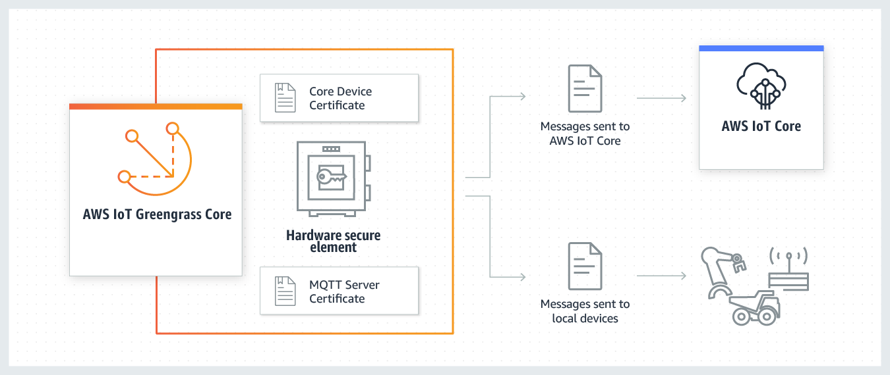

# AWS IoT Greengrass设计解析

> 官网：[https://amazonaws-china.com/cn/greengrass/?c=i&sec=srv](https://amazonaws-china.com/cn/greengrass/?c=i&sec=srv)

AWS设计IoT Greengrass的目的在官网上就说明了：

> **将本地计算、消息收发、数据管理、同步和 ML 推理功能引入边缘设备**

这个需求在目前很多工业物联网边缘计算项目中都会遇到，那么我们看一下AWS是如何来进行设计和架构的。

这图的设计来源于边缘设备的原始需求：如何连接云和设备。这里主要在需求上考虑了以下几点：

* 将云端的能力下发到设备上，这里主要是：本地执行 AWS Lambda 代码
* 消息收发
* 数据管理
* 安全策略

那么在实际场景中就要考虑如何和设备以及云端进行更好的连接：

* 设备端：由于设备端情况复杂，规格不一，通信协议不一致等问题，AWS在考虑上采用了三方面适配，IoT Greengrass端适配，设备端采用sdk工具包进行适配，设备端适配。通过这种方式来屏蔽设备端的差异。
* 云端：云端的链接除了安全之外要考虑现场的网络复杂性，重点是和云端的连接并不可靠，可能是断断续续的连接，所以在设计上要着重对这一情景进行支持。

基于上面的考虑，AWS在设计上又增加了对设备端和云端的连接模块。这一部分拆分是为了更好了区分连接和边缘能力，这在架构上就是边界的划定。通过这一架构，当我们连接不同的设备或者云端时，我们只需要更改我们使用的连接器。

那么边缘能力中，AWS着重描述了安全能力，考虑到设备端很多时候并不具备安全加密的能力，所以由边缘设备来完成更为强大的信息加密功能。

## 总结

AWS在设计边缘端IoT Greengrass时分析了边缘端的场景，引出了边缘端设计的目的 “将本地计算、消息收发、数据管理、同步和 ML 推理功能引入边缘设备”。考虑了设备端和云端连接的复杂场景，在设计上采用了**不变的核心功能和可变的连接功能**分开的设计。并在边缘端的硬件设计上采用了硬件保护来进一步增加设备端和云端的信息保护。