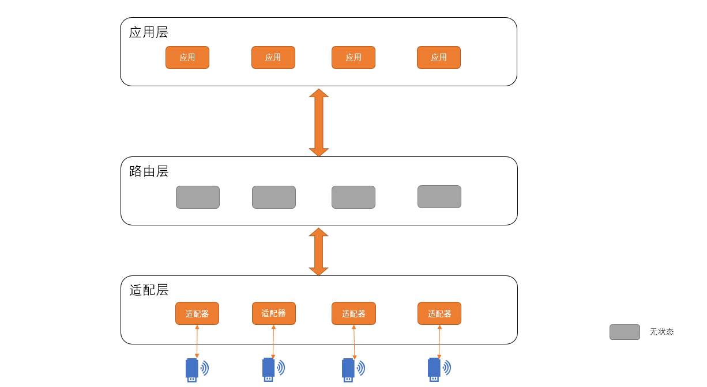

> 文章参考：
> 
> * [从应用层表象出发进行 IoT 架构抽象设计](https://developer.ibm.com/zh/articles/iot-lo-architecture-design-from-application-layer/)
>
> * [全异步的通用高性能物联网架构参考实践](https://developer.ibm.com/zh/articles/iot-lo-architecture-design-from-application-layer2/)
>
> * [高级数据抽象模型下 IoT 的次级数据扩展](https://developer.ibm.com/zh/technologies/iot/articles/iot-lo-architecture-design-from-application-layer3/)

# 数据模型设计

- [数据模型设计](#数据模型设计)
  - [面临的挑战](#面临的挑战)
    - [海量场景的多样性](#海量场景的多样性)
    - [应用和设备高耦合](#应用和设备高耦合)
  - [前提条件](#前提条件)
  - [数据设计](#数据设计)
    - [五元组设计](#五元组设计)
      - [例子](#例子)
    - [设备关系设计](#设备关系设计)
  - [架构设计](#架构设计)
    - [设计思想](#设计思想)
      - [同步还是异步](#同步还是异步)
      - [数据库快照和影子机制](#数据库快照和影子机制)
    - [设计方案](#设计方案)
      - [目标](#目标)
      - [分层设计](#分层设计)
  - [拓展场景](#拓展场景)
    - [边缘计算下的智能属性融合](#边缘计算下的智能属性融合)
    - [设备聚合下的抽象设备概念](#设备聚合下的抽象设备概念)
    - [事件数据记录和预聚合](#事件数据记录和预聚合)
    - [应用服务的设备抽象](#应用服务的设备抽象)

## 面临的挑战

### 海量场景的多样性

**设备异构**

IoT设备有着不同的 CPU 能力和差异巨大的网络环境，直接导致了设备能够处理的数据量、相应处理的延迟时效、重试机制、通信失败与异常的情况比例都存在巨大差异。有时候可能一个命令的下发，回应是分钟甚至是小时级别，所以架构在针对硬件接入这一层上，把这些因素都抽象归总在一起做到完全向上隔离，是一个非常重要的基础要求。

**多种非标准的接入协议**

由于各类 IoT 设备的接入能力、厂商能力和经验以及对应通信模块固件的功能差异，在一个众厂商、多类设备的应用场景下，往往会并存各类完全不同的接入协议而没有一个公认的参考标准。

**多版本并存**

即使对于同一个供应商给出的同一款设备，换代升级的时候也还是会面临到一些功能新增、前向不能兼容等等问题，而且某些设备也并不天然具备 OTA 升级等动态更新固件的功能。也就是说，在实际应用场景当中，可能会存在同时有多个版本的协议并存，在这种情况下，如何能够做到全向兼容，就是一个非常重要的问题了。

### 应用和设备高耦合

考虑到紧张的研发周期、快速的需求迭代周期和有限的人力等因素，那在各种适配定制开发的过程中，几乎无法避免的会引入应用服务、设备接入过度耦合、不同型号设备技术实现混杂等问题。而这些必然会产生的问题，在某款设备出现故障、一款设备的非同步升级迭代、应用需求的差异化变更等情境下，就会进一步放大，以至于持续性的修补而给系统带来更多对稳定的不确定性影响。

## 前提条件

* 所有的操作一定是针对设备的`独立操作`(即使是批量的)
* 每一个设备返回结果的时间和数据都是`不可预知的`，考虑到环境、设备状态等变量因素。
* 所有的设备数据都是以设备为逻辑进行更新同步的，云端无法主动且可信的修改。
* 设备的主要操作可以归类为4类：`创建/删除，配置，状态读取，功能调用`。
* 针对同一类设备，所期望提供的`功能是一致`的。

## 数据设计

### 五元组设计

| 名称 | 说明 | 例子 |
| :-- | :-- | :-- |
| ID | 用来唯一标识一个物理终端的识别码 | 车牌号 |
| 固有属性 | 终端无法修改的属性，出厂固有 | 厂商 |
| 可配置属性 | 可以通过某种方式调整并影响工作状态的参数 | 车内预设温度 |
| 只读属性 | 只能由终端上报且不可配置的属性 | 信号强度 |
| 功能函数 | 通过传入特定的参数，执行设备的操作 | 开锁 |

通过清晰完整的五元组描述，针对下述场景基本就可以实现 100%的覆盖了：

* 查询某一个终端的出厂信息及型号（固有属性）
* 调整某一个终端的工作参数（可配属性）
* 终端主动上报工作状态（只读属性）
* 启动某一个终端的特定功能（功能函数）

#### 例子

| 对象 | 操作 | 五元组等价 |
| :-- | :-- | :-- |
|电表|抄电表号为 A 的表读数|功能函数{读数}({A}) -> {读数}|
|货车|A 火车上报位置|更新 A 的云端只读属性{位置}|
|智能灯|调整灯 A 的亮度|配置 A 的可配属性{亮度}|
|智能锁|开 A 的锁|功能函数{开锁}({A})|
|智能音箱|更换 A 的人声|配置 A 的可配属性{口音}|

### 设备关系设计

通过五元组，我们可以定义一个独立的设备，但是如何表现设备之间的关系，却不是五元组可以解决的。这里我们就要引入树形结构，而树形结构我们可以通过带有树形结构的描述语言或者增加字段来实现，这里作者采用了`树形结构的描述语言`。

|语言|优势|劣势|
|:--|:--|:--|
|Protobuf|有完善的多语言映射工具和语法工具|定义较为复杂，工具链的应用环境较麻烦|
|Java|面向对象有天然的支持且贴近应用|有很多的约定特性是多余的|
|JSON|简洁的数据定义模型，字典和数组的组合可以有效描述，灵活性强|为了可以字符串化，标号过多，影响直观可读性，手写容易搞错|
|YML|极致简洁，而且刚刚好的贴合了设计要求，是的，依稀记得第一次见到 yml 格式时的激动情绪|需要自己写解析，不过这都不是事|

这里作者选中了`yml`,并约定了五元组的格式：
|前缀|类型|
|:--|:--|
|k-|ID|
|p-|固有属性|
|c-|可配属性|
|r-|只读属性|
|f-|功能函数|

通过这种定义，既定义了终端，也定义了终端之间的联系。如果需要额外的描述，可以增加其他的属性来进行拓展。

## 架构设计

### 设计思想

#### 同步还是异步

由于物联网设备存在海量的设备接入场景，并且由于性能和网络原因，无法提供最佳的响应时间。所以`同步的方式并不适用`。所以可以采取基于事件驱动模型的异步方式，增加总线来通知设备的响应结果。

#### 数据库快照和影子机制

由于设备都是由当前的状态信息与可配置的参数信息构成，且设备的状态信息往往是通过某种策略设备主动或被动反馈的，再考虑到设备反馈的时效性，理论上我们可以`将设备的状态抽象成一个不定时更新的数据库表`。这样的一个数据库表的抽象，基本就可以实现完整的业务应用解耦了，而且在不影响使用效果的前提下，也能极大的疏解性能压力，提高效率。

而针对设备可配置参数，我们将引入另一个设计方案即影子同步机制。`影子与本体，分别代表着我们最后一次对设备的期望配置参数与设备反馈来最新的设备上配置参数`。之所以要这样做，是因为由于网络、设备异常等各种问题的存在，一个配置下发的命令并不一定能够很好的执行成功。而由于超高延迟和重试机制的存在，配置设备的应用测也不可能做到等待每一个配置成功还是配置失败。在这种前提下，发现需要重配的设备，获取设备的要求配置参数以及获 取设备的当前工作状态就变的很重要了。影子机制的实现，在数据库里体现为两个基本完全一致定义的表。其中，`所有请求设置设备参数的调用都会直接更新影子表，而所有来自设备的实际参数上报则会直接更新本体表，也就是使用者通过对本体表的查询就能获取实际的设备状态。`当设备返回配置失败的时候，可以通过比较影子与本体表的差别，重新设置为最新的参数。如果请求设置设备的时候设备是离线的，那么当设备上线会主动比对一下影子与本体表是否有差异，如果有差异则立即执行配置命令。

### 设计方案

#### 目标

* 应用开发和设备接入完全解耦
* 同类设备下不同厂商不同批次设备可以无感知接入
* 被动记录所有设备的关键操作

#### 分层设计

基于我们的设计目标，我们采用最为有效的三层设计模型：设备端适配层，中间路由层，应用服务层。

**路由层**

所有的请求和通报都会经过本层来完成转发。路由层提供抽象的数据标准实现，即针对一个设备五元组（ID、固有属性、可配属性、只读属性、功能函数）的 CUDF(Create、Update、Delete、Function) 操作。

在设计上考虑如下几点：

* 来自服务层的更新请求只能更新可配属性。
针对可配属性更新调用配套影子机制，服务层的执行结果为更新影子配置，适配层的执行结果为更新本体配置。
* 创建一个设备的时候 ID 和固有属性都是必带初始化参数，固有属性（除创建外）是完全只读，不提供任何修改接口支持。
* F 操作对象只能是 f 属性，并且需要携带 f 属性约定的 arg 字典作为参数（python 的函数传参底层实现也是一个字典而不是像 C 一样的约定栈序）。
除了 F 操作外，CUD 操作都会直接完成对应数据库的操作，即数据库里的数据永远等同于最新一次操作后的状态。
* 由于设备的操作粒度是基于个体的，所以任何一次 CUDF 请求，都能且仅能携带一个设备 ID。这个很好理解，即使携带了一组 ID 做同样操作，每一个设备都可能因为网络、设备、工作状态等因素而返回不可预知的不同结果。

一次 CUDF 操作在完成数据库更新的同时或之后，会在对侧消息总线上发送一条包含本次请求四元组（ID、类型 C/U/D/F、参数组 -dict、taskID）的消息。关于 taskID 对应一次请求行为结果的追踪。

所有信息的获取都可以通过两种方式直接完成：
* 应用侧的请求发起调用后，等待来自于适配层的操作消息返回，从结果中获取最新值。
* 另一种获取方式为直接查表获取设备的最近同步状态。

拆分来看，针对固有属性肯定查表获取的值都是正确的，配置类属性则每次变更一定是应用侧发起，所以`通过返回结果获取是最准确的`。而设备的状态则一般为适配层自带的逻辑实现，或计划任务式的心跳判断，或设备主动上报的状态同步事件，或其他自定义的判断逻辑，这些更新都是即时写入到数据库的，而且更新频率一般情况下都是分钟级甚至更久，所以`查库获取到的参数时效性正常情况都是没有问题的`。

由于转发着所有的服务层请求以及适配层回应，以及所有的适配层通报，所以`理论上只要我们将所有的请求追踪落库，写入操作 ID、Action 与携带信息，并且通过 taskID 来匹配请求与响应，我们就可以在极少的开发量支持下完成接入本架构所有智能硬件设备的所有操作与通报行为埋点`了，而且即使后续新增接入设备，我们也不需要扩充我们的代码，被动就具备了这样一个新技能，是不是想想就很激动？而且还有一点，由于理论定义的完备性，我们设置不需要考虑会不会有没有覆盖到的行为操作，因为从设计本源上就决定了这套方案能记录我们能记录的最全埋点信息。

**适配层**

在分布式的多节点部署模式下，针对消息的解读有两种模式，一种是抢占式，一种为匹配式。

如果是无连接应用，则发送给一个设备的消息可以由一个分布式集群中的任何一个实例发起，这种情况下抢占式的消息接收模式就很合适了，可以保证没有多余的系统资源浪费，同时又能够实现配置要求。

如果是 TCP 长链接类的设备唯一绑定一个节点的应用，则需要使用匹配模式，即分布式集群中的所有节点都需要收到消息的一个拷贝副本，然后判断收到的消息是否在自己的连接池中，如果在的话则处理消息与设备交互产生结果，不在的话则直接丢弃。相比于抢占模式，匹配模式最大的缺点就在于存在大量的冗余消费行为，当节点数过多的时候这个单机匹配的命中率就会越低，所以在设备有频繁的服务侧交互且适配层分布式节点数量过多的时候，还是需要进行必要的定向优化，以提升系统的吞吐量。

`适配层除了能够完全隔离来自于设备协议和性能等客观差异情况带来的隔离传播外，还可以很好的完成故障阻断和动态扩容`。

当某一节点甚至整个适配层集群出现故障，其他的节点或者其他的设备由于与中心路由层的依赖关系只有消息读取和请求调用，所以即使共用一个路由也不会收到负面影响，从服务层来看只是受影响的个别设备或同类设备出现的无法在有效时间内响应异常，并不会严格意义上影响系统工作状态。

另外需要注意的一个问题是，有时候我们可能会有非状态类的应用模式，如数据流的原始数据大数据存储等，这种情况下`我们可以再应用层上开辟一个临时专用通道来完成对应的结果需求输出，从而可以至少临时性的满足业务侧需求。`

**服务层**

路由接入方式也是包括 RPC 类 CUDF 调用请求以及监听 Kafka 总线来获取反馈消息。由于我们的数据声明模型提供了可供自由组合的完整原子操作集，所以业务侧可以根据数据模型定义按需组合出自己期望的调用模式。

当一次服务侧的请求调用，可能因为设备离线、故障、网络不稳定、性能阻塞等等各种原因面临随机性的失败、高延迟等情况，所以使用异步调用模式，即请求发出后即生成一个 taskID 追踪号返回给服务侧，同时把这个 taskID 协同本次请求发射到适配层，这样本次操作的执行过程就会全程携带 taskID，直到适配层执行完毕后，将带有 taskID 的 CUDF 操作再一次通过路由层发送到服务层的消息总线上，侦听总线的服务侧对应程序就可以通过 taskID 来甄别是否是自己发起的调用了。

## 拓展场景

### 边缘计算下的智能属性融合

由于云分析天然存在对传输延时、传输带宽、公网联通性等外部环境的依赖问题，所以一般意义上我们采用的都是设备局部环境内通过近距通道接入一些分析机（一般为 PC/盒子）来实时分析的方式来扩展设备的这些能力，也就是这些能力并不能有终端本身来完成。

虽然数据并不直接由终端本身直接产出，但是由于终端是分析节点的注入的数据源，所以边缘分析的结果一般都唯一关联到源头终端（数据来源于多个终端的情况会在下一节说明），也就是严格意义上划属于基于设备根节点扩展的基础属性，进而也就可以进行直接的数据关联。即使是进行参数调配、算法调配，虽然有可能是批量成组的修改，但原子粒度也一定是映射到某个终端的分析标准，所以也都是可以认为针对于终端节点或者终端子节点的创建、修改操作。

### 设备聚合下的抽象设备概念

某些情况下，我们的分析结果是以一组设备的汇聚数据流为输入的。这时候我们可以抽象一个虚拟设备可以提供完备的功能。虽然数据来源可能来自于多个同类或者不同类型的设备，部分特殊场景下甚至在物理上相距很远的不同终端，但是数据的输出都可以认为是一个看起来像一个设备的虚拟设备代理的身份输出的。也就是说，我们将用来做数据输出的这个设备抽象出来成为一个定义的设备节点，理论上也可以清晰的满足使用者的需求。

### 事件数据记录和预聚合

对于一个设备来讲除了可以读取的瞬态变量外，还有大量事件需要行为来进行记录。虽然原则上，这应该是来自于服务侧进行的应用策略，但是换个角度来看，事件亦属于创建后无法配置且无法更改的一种特殊节点，由设备的 ID 与流水创建的标示 ID 唯一的定位。

事件类应用本身还可以进行一个扩展，也就是在大数据分析场景下的一种特例应用，即预聚合。我们在进行分析或者过滤的时候，一般会将数据进行聚合处理来分类甄别需要关注的对象。由于物联网设备很多情况下都是持续性的上报数据，直接进行全量聚合的话，会面临海量设备和海量采样点的计算，并且如果查询的频率较高，对应的计算代价和响应时间都会变得无法接受。但是这种查询有一个特点，每次计算在同样时间段内的数据都会重复演算多次，会有大量的算力浪费情况存在，所以理论上这种情况是存在优化方法的。以时间维度的统计为例，我们可以采用 `量级下降` 的方法，针对日常时间轴进行块级切分，如日、周、月、年为单位进行预聚合统计，这样就不用每次都全量扫描所有的原始数据点，而大幅度减少重复过滤查询下的系统性能消耗。

### 应用服务的设备抽象

虽然说我们的数据定义标准来自于我们对物联网设备的高层数据模型抽象，但是这并不等同于这套标准只能应用于物联网设备的模型定义。我们回归到这个数据定义的形式来看的话，可以发现任何可以使用五元组（ID、固有属性、可配属性、只读属性、功能函数）来进行完备描述（可以是五元组的一个子集）的应用，都可以套用这套描述模型。而应用模型所带来的最大优势，就是可以使用一个清晰的树状结构和说明来给应用提供一个解耦与架构化部署的理论与工具链支撑，尤其是在优化与重构系统的时候，可以快速理清系统的基础逻辑关系并提供可预期的性能提升参考，并且在提供最小粒度原子化操作的同时还可以很好的支持到读写分离、中台化等理念的实际落地。