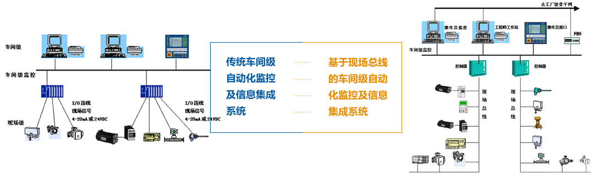
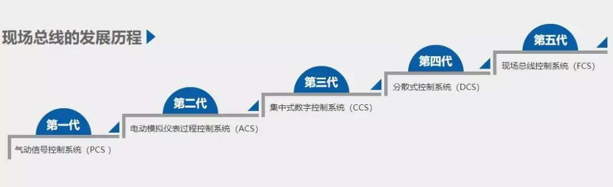
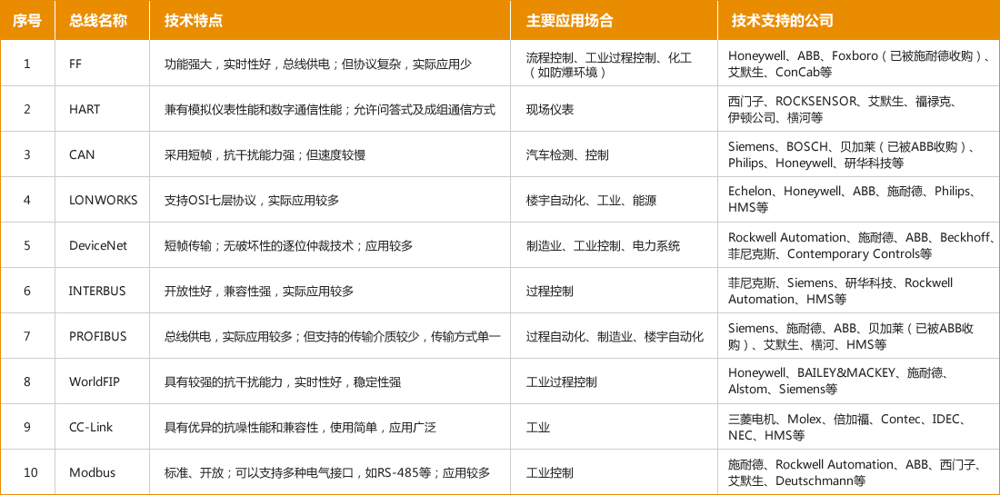

# 现场总线

现场总线（Field bus）是近年来迅速发展起来的一种工业数据总线，它主要解决工业现场的智能化仪器仪表、控制器、执行机构等现场设备间的数字通信以及这些现场控制设备和高级控制系统之间的信息传递问题。

## 定义

国际电工委员会IEC标准和现场总线基全会FF将现场总线定义为：现场总线是连接智能现场设备和自动化系统的数字式、双向传输、多分支结构的通信网络。换句通俗地话，**现场总线就是将分散的有通信能力的测量控制设备作为网络节点，连接成能相互沟通信息，共同完成自控任务的控制网络**。

## 现场总线 vs 传统现场

它是一种工业数据总线，是自动化领域中底层数据通信网络。简单说，现场总线就是以数字通信替代了传统 4-20mA 模拟信号及普通开关量信号的传输，是连接智能现场设备和自动化系统的全数字、双向、多站的通信系统。

现场总线，往往是安装在楼宇或者更远距离的需求，连接各个设备之间，获取数据或者控制执行器的总线，例如传感器网络的连接。需要获取各个安装在现场的分散式传感器的数值的需求。这类总线类似 RS485,CAN,POWERBUS 等。现场总线更多的是考虑的长距离传输的时候信号稳定性，抗干扰性。它还具有接线简单，工程周期短，安装费用低，维护容易，可靠性高，稳定性好，抗干扰能力强，通信速率快，系统安全，符合环境保护要求等优点。

* 传统的现场级自动化监控系统采用一对一连线的 4-20mA/24VDC 信号，信息量有限，难以实现设备之间及系统与外界之间的信息交换，使自控系统成为工厂中的 "信息孤岛"，严重制约了企业信息集成及企业综合自动化的实现。

* 基于现场总线的自动化监控系统采用计算机数字化通信技术，使自控系统与设备加入工厂信息网络，构成企业信息网络底层，使企业信息沟通的覆盖范围一直延伸到生产现场。例如，利用现场总线技术可使用一条通信电缆将现场设备（智能化、带有通信接口）连接，用数字化通信代替 4-20mA/24VDC 信号，完成现场设备控制、监测、远程参数化等功能。

## 特点

* **系统的开放性**

传统的控制系统是个自我封闭的系统，一般只能通过工作站的串口或并口对外通信。在现场总线技术中，用户可按自己的需要和对象，将来自不同供应商的产品组成大小随意的系统。

* **可操作性与可靠性**

现场总线在选用相同的通信协议情况下，只要选择合适的总线网卡、插口与适配器即可实现互连设备间、系统间的信息传输与沟通，大大减少接线与查线的工作量，有效提高控制的可靠性。

* **现场设备的智能化与功能自治性**

传统数控机床的信号传递是模拟信号的单向传递，信号在传递过程中产生的误差较大，系统难以迅速判断故障而带故障运行。而现场总线中采用双向数字通信，将传感测量、补偿计算、工程量处理与控制等功能分散到现场设备中完成，可随时诊断设备的运行状态。

* **对现场环境的适应性**

现场总线是作为适应现场环境工作而设计的，可支持双绞线、同轴电缆、光缆、射频、红外线及电力线等，其具有较强的抗干扰能力，能采用两线制实现送电与通信，并可满足安全及防爆要求等。

## 发展历程

随着信息与科学技术的迅猛发展，信息交换方式日新月异，并朝着全球化与数字化的方向发展，自动控制系统作为信息与科学技术发展的融合产物，自 19 世纪以来的近两百年里也发生了巨大变革。总的来说，一般可将其划分为 5 代：

* 第一代：气动信号控制系统（PCS）

* 第二代：电动模拟仪表过程控制系统（ACS）

* 第三代：集中式数字控制系统（CCS）

* 第四代：分散式控制系统（DCS）

* 第五代：现场总线控制系统（FCS）

## 主流现场总线比较

## 参考

* [现场总线——让工业物联网通讯更快捷](https://www.iiot.com/news/266.html)