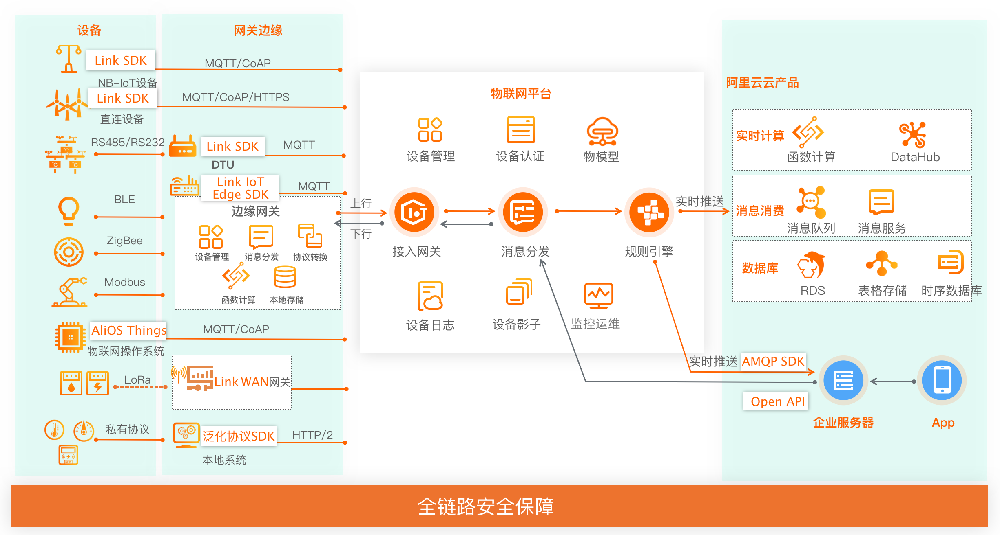
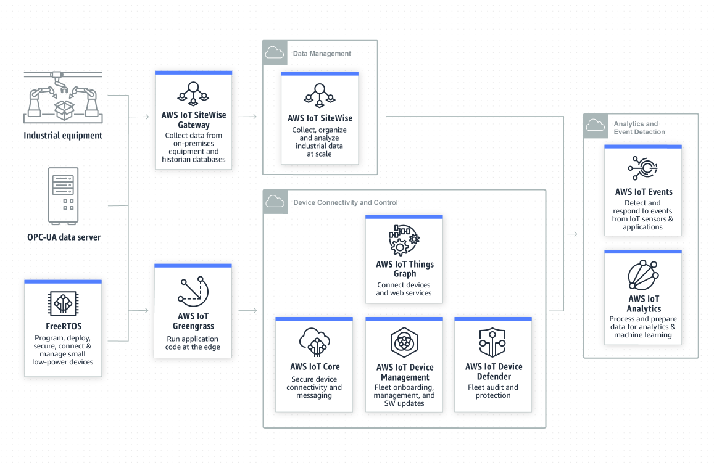
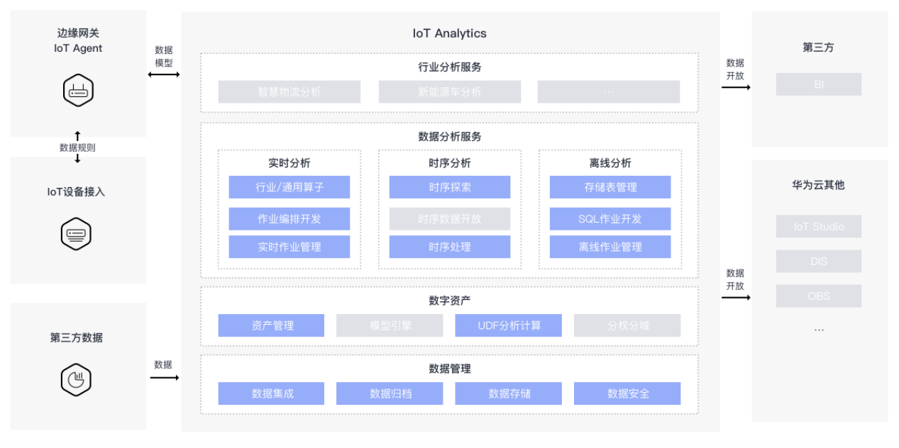
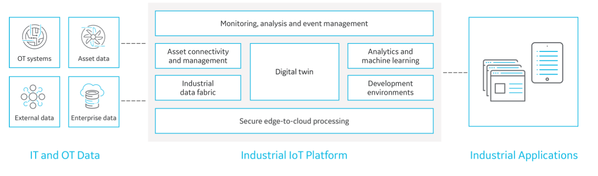
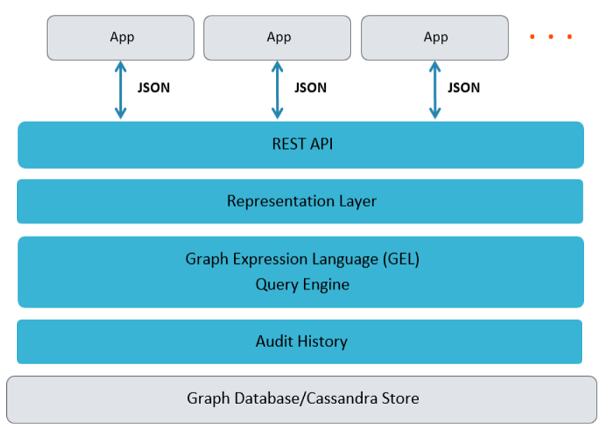

# 工业大数据

- [工业大数据](#工业大数据)
  - [分类](#分类)
  - [平台](#平台)
    - [阿里云物联网平台](#阿里云物联网平台)
      - [架构](#架构)
    - [AWS IIoT服务](#aws-iiot服务)
    - [Micorsoft Azure IIOT Analytics](#micorsoft-azure-iiot-analytics)
      - [架构](#架构-1)
      - [数据流](#数据流)
    - [华为 IoT数据分析](#华为-iot数据分析)
    - [GE Predix平台](#ge-predix平台)
      - [资产服务](#资产服务)

工业大数据主要是采集工业领域中从需求到销售、订单、计划、研发、设计、工艺、制造、采购、供应、库存、发货到最终交付、售后、服务、运维、报废等全生命周期所产生的各类数据。建立工业打算数据平台的最终目的就是为了提高工业生产过程价值的提升或者变现。并为企业管理资产上提供数据支撑。

## 分类

工业大数据可以从数据来源上分成三大类：业务数据，制作过程数据，外部数据。

* **业务数据**：企业在管理过程中产生的业务数据，包括企业资源计划(ERP)、产品生命周期管理(PLM)、供应链管理(SCM)、客户关系管理(CRM)和能耗管理系统（EMS)等。这类系统是工业企业传统意义上的数据资产，这类数据的特点是数据格式多样，系统复杂，专业性较强。
* **制作过程数据**：工业生产中，产生的各种生产数据，主要通过MES形同实时传递。这类数据是目前增长最快的数据。
* **外部数据**：包括产品售出后的使用，运营情况的数据，还有其他比如客户名单，供应商名单，外部互联网数据等。

## 平台

### 阿里云物联网平台

> [https://help.aliyun.com/document_detail/30522.html](https://help.aliyun.com/document_detail/30522.html)

#### 架构

### AWS IIoT服务

> [https://aws.amazon.com/cn/iot/solutions/industrial-iot/?nc=sn&loc=3&dn=2](https://aws.amazon.com/cn/iot/solutions/industrial-iot/?nc=sn&loc=3&dn=2)

### Micorsoft Azure IIOT Analytics

> [https://docs.microsoft.com/en-us/azure/architecture/guide/iiot-guidance/iiot-architecture](https://docs.microsoft.com/en-us/azure/architecture/guide/iiot-guidance/iiot-architecture)

#### 架构

#### 数据流

### 华为 IoT数据分析

> 

### GE Predix平台

> [https://www.predix.io/](https://www.predix.io/)

#### 资产服务

