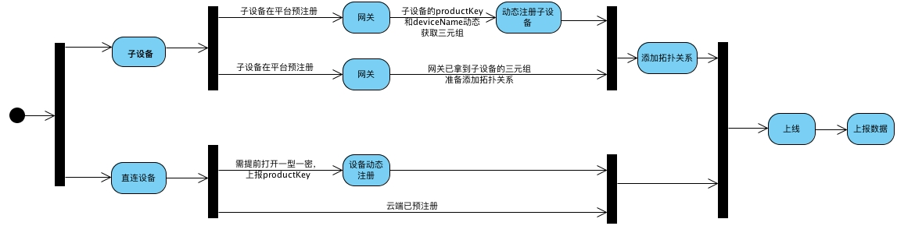
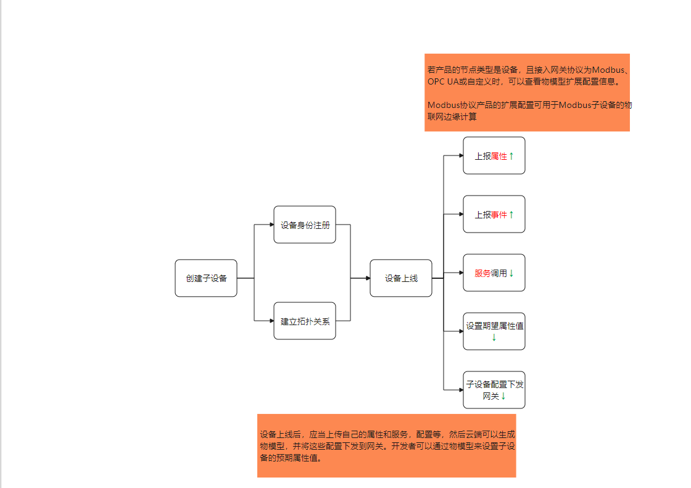

# 设备流程

阿里云物联网平台中的设备数据交换采用的是Alink协议。

## 设备上线



### 直连设备

直连设备可以通过提前烧录设备证书或者产品证书来进行设备注册，上线和数据上报。

### 子设备

子设备注册时通过网关发起，可以通过下面两种方式：

* 子设备直接烧录设备证书，将设备证书发给网关，网关首先添加拓扑关系，将设备上线，然后上传数据
* 子设备将ProductKey和DeviceName通过网关传给平台，由平台进行验证，然后下发设备证书。子设备得到后将设备证书上传给网关，网关添加拓扑关系，将设备上线，然后上传数据。

总体流程就是：

```
【子设备】 --设备证书--> 【网关】 --添加拓扑关系，并开始上传数据，将设备上线 --> 【平台】
```

子设备上线的基本要求是：**设备身份**和与网关的**拓扑关系**。

