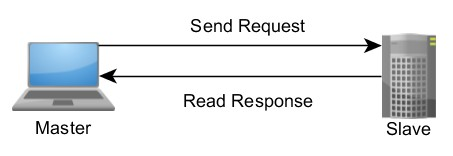

# Modbus协议

## 概览

Modbus​是​一种​工业​协议，​于​1979​年​开发，​旨​在​实现​自动​化​设备​之间​的​通信。 Modbus​最初​是​作为​通过​串​行​层​传输​数据​的​应用​级​协议​实现​的，​现​已​扩展​到​包括​通过​串​行、​TCP/​IP​和​用户​数据​报​协议​（UDP）​的​实现。

## 什么是Modbus协议

Modbus​是​使用​主从关系​实现​的​请求 - 响应​协议。 在​主从关系​中，​通信​总是​成​对​发生 - 一个​设备​必须​发起​请求，​然后​等待​响应 - 并且​发起​设备​（主​设备）​负责​发起​每次​交互。 通常，​主​设备​是​人​机​界面​（HMI）​或​监​控​和​数据​采集​（SCADA）​系统，​从​设备​是​传感器、​可​编​程​逻辑​控制器​（PLC）​或可​编​程​自动​化​控制器​（PAC）。 这些​请求​和​响应​的​内容​以及​发送​这些​消息​的​网络​层​由​协议​的​不同​层​来​定义。

## 特点

* 免费
* 支持多种电气接口
* 帧格式简单，通俗易懂好开发
* 可靠性好，Modbus协议需要对数据进行校验，串行协议中除有奇偶校验外，ASCII模式采用LRC校验，RTU模式采用16位CRC校验，但TCP模式没有额外规定校验，因为TCP协议是一个面向连接的可靠协议（PS：也就是说modbusTCP实际上是Modbus利用TCP打包数据传输的一种方式）。另外，Modbus采用主从方式定时收发数据，在实际使用中如果某Slave站点断开后(如故障或关机)，Master端可以诊断出来，而当故障修复后，网络又可自动接通。

## 标准网络

ModBus网络只有一个主机，所有通信都由他发出。网络可支持247个之多的远程从属控制器，但实际所支持的从机数要由所用通信设备决定。采用这个系统，各PC可以和中心主机交换信息而不影响各PC执行本身的控制任务。

当在一Modbus网络上通信时，每个控制器须要知道它们的设备地址，识别按地址发来的消息，决定要产生何种行动。如果需要回应，控制器将生成反馈信息并用Modbus协议发出。在其它网络上，包含了Modbus协议的消息转换为在此网络上使用的帧或包结构。这种转换也扩展了根据具体的网络解决节地址、路由路径及错误检测的方法。

主设备可单独和从设备通信，也能以广播方式和所有从设备通信。如果单独通信，从设备返回一消息作为回应，如果是以广播方式查询的，则不作任何回应。Modbus协议建立了主设备查询的格式：设备（或广播）地址、功能代码、所有要发送的数据、错误检测域。从设备回应消息也由Modbus协议构成，包括确认要行动的域、任何要返回的数据、和一错误检测域。如果在消息接收过程中发生一错误，或从设备不能执行其命令，从设备将建立一错误消息并把它作为回应发送出去。

## 其他网络

在其它网络上，控制器使用对等技术通信，故任何控制都能初始和其它控制器的通信。这样在单独的通信过程中，控制器既可作为主设备也可作为从设备。提供的多个内部通道可允许同时发生的传输进程。

在消息位，Modbus协议仍提供了主—从原则，尽管网络通信方法是“对等”。如果一控制器发送一消息，它只是作为主设备，并期望从从设备得到回应。同样，当控制器接收到一消息，它将建立一从设备回应格式并返回给发送的控制器。

## 数据模型

通常，​Modbus​可​访问​的​数据​存储​在​四​个​数据​库​或​地址​范围​的​其中​一个： 线圈​状态、​离散​量​输入、​保持​寄存器​和​输入​寄存器。 与​许多​规范​一样，​名称​可能​因​行业​或​应用​而​异。 例如，​保持​寄存器​也可以​称为​输出​寄存器，​线圈​状态​可能​称为​数字​或​离散​量​输出。 这些​数据​库​定义​了​所​包含​数据​的​类型​和​访问​权限。 从​设备​可以​直接​访问​这些​数据，​因为​这些​数据​由​设备​本地​托管。 Modbus​可​访问​的​数据​通常​是​设备​主​存​的​一个​子​集。 相反，​Modbus​主​设备​必须​通过​各种​功能​代码​请求​访问​这些​数据。

|内存​区块|数据​类型|主​设备​访问|从​设备​访问|
|:---|:---|:---|:---|
|线圈​状态|布尔|读/写|读/写|
|离散​输入|布尔|只读|读/写|
|保持​寄存器|无​符号​双​字​节​整型|读/写|读/写|
|输入​寄存器|无​符号​双​字​节​整型|只读|读/写|

## 参考

* [Modbus​协议​深入​讲解](https://www.ni.com/zh-cn/innovations/white-papers/14/the-modbus-protocol-in-depth.html)
* [Modbus协议详解](https://www.jianshu.com/p/f7fd49a51f23)