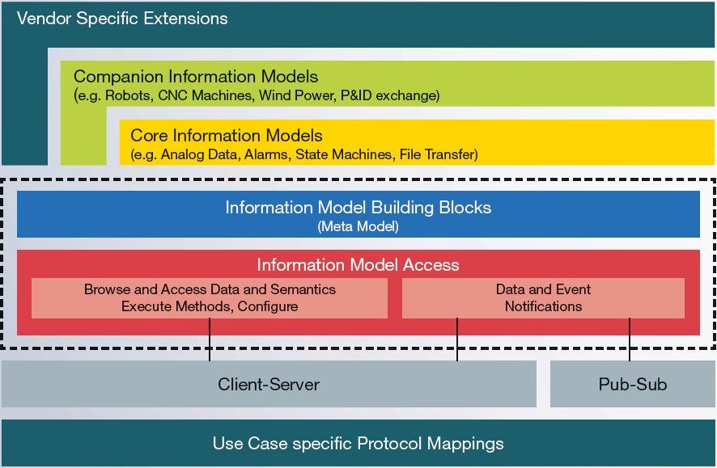

# OPC UA协议

OPC UA是OPC Unified Architecture的简称，是OPC基金会基于原有OPC协议的基础上推出的新的标准。OPC UA协议从名称中就可以看出是为了应对跨平台的趋势，能够达到只使用一个地址空间就能访问所有的对象，不受平台系统的限制。

起初，OPC是在微软Windows的OLE技术基础上，使用COM/DCOM（分布式组件对象模型）在软件组件之间交换数据，OPC是OLE for Process Control的缩写（用于过程控制的OLE）。经典的OPC标准有OPC DA（数据采集）、OPC Alarms&Events（报警和事件）、OPC HDA（历史数据）。

而随着工业的发展，人们对OPC技术的需求更加越来越高，对数据交互，安全性等要求的前提下，2008年发布的OPC统一架构（UA）将各个经典OPC规范的所有功能集成到一个可扩展的框架中，独立于平台并且面向服务。

> 官网：[https://opcfoundation.org/about/opc-technologies/opc-ua/](https://opcfoundation.org/about/opc-technologies/opc-ua/)

## 设计目标

1. 功能对等：集成了之前所有的OPC协议的特性和信息，比如A&E,DA,OPC XML DA和HDA
2. 平台无关：更加开放，平台无关性，Windows和Linux都能兼容
3. 安全性：在协议和应用层集成了安全功能，更加安全
4. 拓展性：拓展了对象类型，支持更复杂的数据类型比如变量，方法和事件
5. 良好的信息模型：支持定义复杂的模型

### 功能对等

OPC UA支持原有的OPC协议的功能，并且进行了延伸和拓展。

* Discovery：查询本地网络或电脑上的OPC Server
* Address space：所有的数据都是按照层次结构表示（例如files和folders），从而OPC Clients可以使用简单或者复杂的数据。
* On-demand：数据的读取和写入都需要访问权限
* Subscriptions：根据Clients的规则来进行数据的监控和异常的报警
* Events：根绝Clients的规则来通知重要的信息
* Methods：Clients可以运行程序或者脚本

### 平台无关

OPC UA支持各种硬件和软件平台：

* 硬件：电脑，主机，服务器，PLC，ARM等
* 操作系统：Windows，Apple OSX，Android，Linux等

### 安全性

OPC UA在安全性方面做了很多工作：

* 传输：提供了很多可选配置，比如超快速OPC二进制传输和基于Websocket的JSON
* 会话加密：各种加密级别的消息传输
* 信息签名：通过信息签名，接收者可以验证信息的来源和完整性
* 顺序数据包：可以有效防止重播攻击
* 权限认证：每个UA客户端和服务器都通过X509证书进行标识，从而可以控制允许哪些应用程序和系统相互连接
* 允许用户控制：应用程序可以要求用户进行身份验证，可以限制或增强其权限或者地址空间访问
* 审核：记录用户或系统的活动，来跟踪审核访问的记录

### 拓展性

OPC UA在设计上采用了多层架构，保证了对未来协议和技术的兼容性，同时保持对已有设备的一致性兼容。

### 良好的信息模型
OPC UA在信息模型上采用面向对象的设计，使得即使是最复杂的多层结构也能很好的建模和拓展。

从架构图中我们可以看到，OPC UA定义了拓展接口和基本的模型，其他人可以通过拓展这些来实现自己的模型。

OPC UA同时也定义了信息模型的访问机制：

* 浏览本地实例对象的机制
* 对当前数据和历史数据的读写方式
* 可执行的方法
* 数据和实践的通知机制

同时提供了两种通信方式：Client-Server和Pub-Sub。其中Client-Server每条信息都是针对单个客户端，而Pub-Sub测试多对多的方式。

## OPC UA TSN[1](./tsn.md)

### 需求来源

由于OPC UA欠缺一定实时性，所以要推荐OPC UA TSN，即OPC UA Over TSN。OPC UA来解决语义互操性，TSN负责解决实时性问题。

## 常见问题

1. OPC UA属于哪一层的协议？
   
   应用层

2. 和OPC UA并列的还有哪些工业物联网协议？

    CANOpen,Profinet,Modbus

## 参考文章

* [OPC-UA技术在SCADA上的应用](https://mp.weixin.qq.com/s?subscene=23&__biz=MzA4NTQ5MTIzNA==&mid=2649929755&idx=1&sn=e8b9e70fca32e0e337006eefba1f6b7c&chksm=87d13356b0a6ba406e3a4bcdcc7b7f8485e2ee38b4e28806fa4c293d027b80f979a8c79a3886&scene=7&key=416803f1530d0e77a7a32dbd19c84b5093cbc28d1ef7ca3d6d20f4826401c9377b6b3b4bcbb658f09b7501a82694761ae0d2b76d07959a9cfb1c5e439df22db5835d92165bcd87603e99f801790443fae94a9192cab922788529de4296f13d12cedc49b36573ea8d5904b48a61d7110a3142e6733d78f7b1a9a92c50e91b04e0&ascene=0&uin=NTkyMjg4NQ%3D%3D&devicetype=Windows+10+x64&version=6300002f&lang=zh_CN&exportkey=AQqPS2Qsm9%2Fgp6%2FPX4YhESE%3D&pass_ticket=HGuHrG7jjjdrE7HPMUEY6u5Fpu3R65Fm1y%2Fe1ceod4kcNAhXXOROOcuDr2CpFf2T&wx_header=0)

* [【对话老宋】深入浅出OPC UA经典十五问](https://mp.weixin.qq.com/s?subscene=23&__biz=MzA3ODA0NDYyMw==&mid=2658339134&idx=1&sn=c2650339e487048f3467efab099aa645&chksm=84cf659eb3b8ec88acd28b82b0b45a00df37f97ccfb5736e0b79e0a7b5d5cd3be631d64b1a15&scene=7&key=3a4727f7169ab807bcc55b734e29915941e997609dde2402eb5166de021a8ed6acd8186b80abefa8f988e8072f719e188873080df95927c70a242d3c058902f86e02fe2c70231ca4d95fc292eed70c68f6b065f7c898d913533fe1d53901fc43097acf6d63e50002cc2f4d782869157e2b787deb60dac0fae25eceed70cd4b13&ascene=0&uin=NTkyMjg4NQ%3D%3D&devicetype=Windows+10+x64&version=6300002f&lang=zh_CN&exportkey=AVCp%2BDpxfsU41ReG8nFg7A0%3D&pass_ticket=gR0quaGlkm1uBmSeEDUBuHRps%2B0Tm5mUo1%2Fg20TwhW38%2BOQtrdAqevLUAr0BH3Cc&wx_header=0)