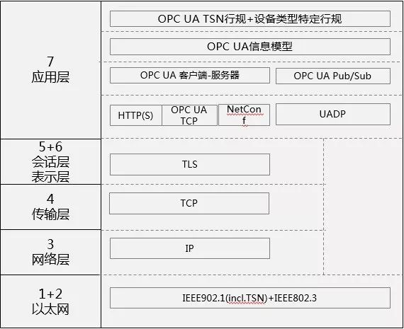
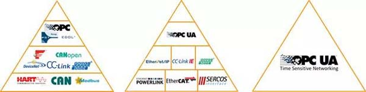
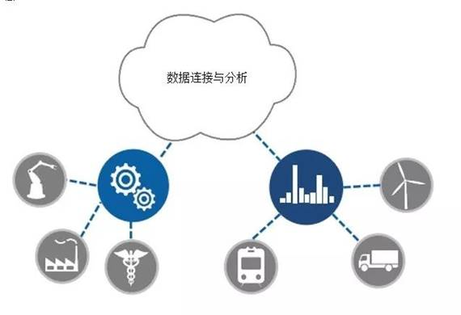
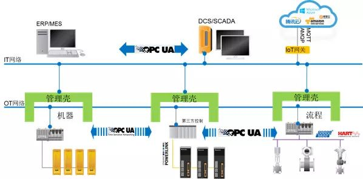

# OPC UA TSN

## 需求来源

由于OPC UA欠缺一定实时性，所以要推荐OPC UA TSN，即OPC UA Over TSN。OPC UA来解决语义互操性，TSN[1](./tsn.md)负责解决实时性问题。

## IT和OT融合难度在哪里

### 现场总线到实时以太网

下图是一个对于制造业现场的通信网络进行了简要的描述，相对于传统的PLC集中式控制，现场总线为工业控制系统带来了很多便利，通过统一的总线连接实现了分布式控制，并且通过总线使得接线变得更为简单，而系统的配置、诊断的工作量因此也下降，因此，现场总线是为制造业现场带来很多便利的技术，然而，各家公司都开发了自己的总线，在IEC的标准中也有多达20余种总线。总线本身是带来便利的，但是，不同的总线又造成了新的壁垒，因为各家公司的业务聚焦、技术路线的不同，使得各个现场总线在物理介质、电平、带宽、节点数、校验方式、传输机制等多个维度都是不同的，因此造成了同一总线标准设备可以互联，而不同总线设备则无法互联。

这也是因何实时以太网技术在21世纪初开始投入使用的原因，2001年贝加莱推出POWERLINK实时以太网是工业领域第一个实时以太网，相较于传统总线，实时以太网的好处在于物理介质、节点数、距离、带宽、校验、诊断都统一采用标准的IEEE802.3网络，因此在这个层面上，大家实现了统一。

### 互联互通和互操作

但是，实时以太网只是解决了物理层与数据链路层的问题，对于应用层而言，仍然无法联通—按照IEC的标准，通信连接分为互连、互通、互操作多个层级，各个实时以太网是基于原有的三层网络架构（物理层、数据链路层、应用层），在应用层采用了诸如Profibus、CANopen等协议，而这些协议又无法实现语义互操作。

简单理解语义互操作就是“5+5”这样的计算在自动化控制中，是物理的信号直接进行的处理，而对于IT网络传输更多丰富的数据结构与类型时就会需要更多信息，如单位，“5英寸+5厘米”显然是无法进行加法计算的，这个时候我们需要语义规范与标准，以便让不同的系统之间认识到各自每个参数所表达的语义。

### 智能时代的工业通信

在前面我们讨论的是在工业现场水平与垂直方向实现物理信号的采集与信息的传输，但是，到了智能制造时代，我们需要更为全局的数据采集、传输、计算与分析、优化，进而实现制造的高效协同，提升整个生产效率。

下图简要描述了这一场景，从工厂到供应链的各个环节都需要数据的连接，那么这个时候，IT与OT的融合会遇到如下复杂性：

* 总线的复杂性带来的障碍

总线的复杂性不仅为制造现场带来复杂性，也同样为IT访问OT带来了巨大的障碍，因为为了不同的数据访问就得写不同的网络驱动程序，对于老的工厂采用的不同的物理介质的现场总线还需要配置额外的网络适配模块，然后就是在软件层面的驱动程序，即使采用实时以太网，语义仍然需要编写不同的接口程序，而丰富的现场总线与应用层组合出成千上万种可能，这使得IT为了配置网络、数据采集与连接、数据预处理等工作花费巨大，这使得实现这件工作缺乏经济性—这是技术推进难的首要障碍，如果无法经济的实施项目，那么就没有投入的必要。

* 周期性与非周期性数据的传输

IT与OT数据的不同也使得网络需求差异，这使得往往采用不同的机制，对于OT而言，其控制任务是周期性的，因此采用的是周期性网络，多数采用轮询机制，由主站对从站分配时间片的模式，而IT数据往往是非周期性的，由于标准以太网无法满足周期性的确定性传输以及微秒级的实时性，才开发了POWERLINK、Profinet等基于以太网的协议，然而，这些都无法在一个网络里传输两种不同的数据。

* 实时性的差异

由于实时性的需求不同，也使得IT与OT网络有差异，对于微秒级的运动控制任务而言，要求网络必须要非常低的延时与抖动，而对于IT网络则往往对实时性没有特别的要求，但对数据负载有着要求。

## OPC UA TSN的角色

OPC UA主要解决在应用层的问题，而TSN实质上是处于数据链路层。

### OPC UA的角色与意义

参考[OPC UA协议](opc_ua_guide.md)

### TSN的角色与意义

参考[TSN时间敏感网络协议](tsn.md)

### OPC UA TSN架构了未来智能制造网络

实际上OPC UA和TSN贯穿了整个OSI七层模型，使得通过统一标准与规范实现了一个真正的“工业互联网”—Industrial Internet。

上图则是整个基于OPC UA TSN的工业互联网架构，我们可以看到，通过OPC UA在水平方向的不同品牌的控制器的设备可以被集成，而在垂直方向设备到工厂再到云端都可以被OPC UA连接。

而TSN则在控制器、控制器与底层传感器、驱动器之间的物理信息传输，OPC UA即可实现与传统的实时以太网结合构成数据的多个维度集成，在未来也可以通过TSN与OPC UA的集成实现全新的制造现场网络集成。

## 技术发展

OPC UA已经成为IEC标准，并在2017年成为中国国家推荐性标准，在2018年发布了基于Pub/Sub的机制作为OPC UA的补充机制，在Part 13部分由IEC发布。

TSN目前由IEEE标准组织进行标准的制定工作，目前已经完成的状态如表2。

## 总结

OPC UA与TSN代表了未来工业互联网的技术趋势，也代表着OICT融合的实现道路，本文主要从OT的视角来理解OPC UA和TSN，对于IT端的应用而言，OPC UA TSN提供了访问的便利，然后才能进而产生业务模式的创新，基于边缘计算的产业应用场景，基于云连接的智能优化，以及产业业务模式的转变，真正实现数字化转型。

## 参考链接

* [OPC UA TSN真的会成为未来工业通信的统一标准吗？](https://zhuanlan.zhihu.com/p/42704948)
* [未来工业通信的“通用语言”——OPC UA TSN](https://www.sdnlab.com/23113.html)