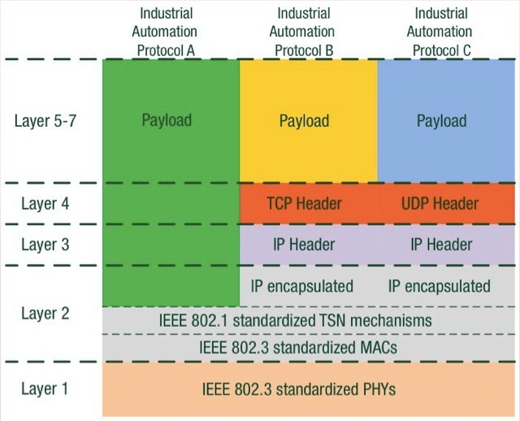
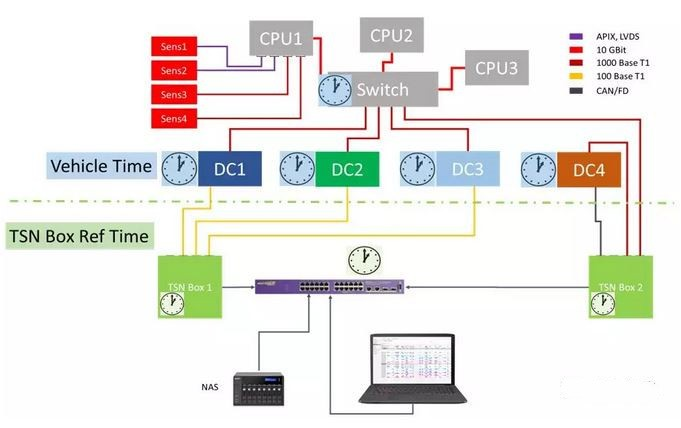

# TSN时间敏感网络协议

## 需求来源

TSN是一项从视频音频数据领域延伸至工业领域、汽车领域的技术。TSN最初来源于音视频领域的应用需求，当时该技术被称为AVB，由于针对音视频网络需要较高的带宽和最大限度的实时，借助AVB能较好的传输高质量音视频。

2006年，IEEE802.1工作组成立AVB音频视频桥接任务组，并在随后的几年里成功解决了音频视频网络中数据实时同步传输的问题。这一点立刻受到来自汽车和工业等领域人士的关注。2012年，AVB任务组在其章程中扩大了时间确定性以太网的应用需求和适用范围，并同时将任务组名称改为现在的：TSN任务组。TSN是以以太网为基础的新一代网络标准，具有时间同步、延时保证等确保实时性的功能。

## 使用场景

TSN使用标准以太网提供分布式时间同步和确定性通信。因此，任何需要分布式测量或控制的应用都可以从TSN中受益。客户可使用TSN进行简单的分布式同步测量、下一代计算机数控加工的改进、新型半导体加工机器以及未来的电网研究等。在其他行业的应用包括：

### 音视频传输

TSN最初来源于视频领域的应用需求。传输音频和视频信息的网络需要遵守严格的时序规则。如果音频或视频分组不能按指定的时序规则到达目的地，则接收设备（例如视频屏幕或扬声器）可能会发生视频帧被丢弃、音频伪像的情况。此外，这种网络还需要可预测的延迟，保证视频和相关音频流之间的同步。另一方面，足球赛事的实况转播有很多高清的数据要通过网络传输到处理中心，对带宽的需求极大。而且为了最大限度的提供实时性，这些图像、音频必须实现高实时的传输与处理，可以想象其对带宽和实时性的需求。

### 汽车驾驶

目前大多数的汽车控制系统非常复杂。比如说：刹车、引擎、悬挂等采用CAN总线。而灯光、车门、遥控等采用LIN系统。娱乐系统更是五花八门，有FlexRay和MOST等目前的车载网络。实际上，所有上述系统都可以用支持低延时且具有实时传输机制的TSN进行统一管理。可以降低给汽车和专业的A/V设备增加网络功能的成本及复杂性。

在车辆中，实时功能对于某些应用至关重要。 为确保这些实时功能可用，必须在以太网控制器中设置具有直接访问硬件资源的机制。TSN使构建可扩展的以太网网络成为可能。为此，不同的消息按照其可用性分为了不同的等级，并对其延迟和优先级进行了分类，每个消息类被分配到一个固定的带宽。此外，TSN还支持冗余以太网系统，并且，为确保稳定的数据交换，定义了安全标准。

### 工业物联网

标准以太网的本质是一种非确定性网，但在工业领域必须要求确定性，一组数据包裹必须完整、实时、确定性的到达目的地，因此较新的TSN标准增加了中心控制、所有网络设备的时间同步以及更低的延迟等特性。为了达到尽可能低的绝对延迟，IEEE 802.1Qbv定义了一个时间感知整形器，它可以无视定时流量门的存在。

TSN除了解决以太网的不确定性问题，还正在解决工业领域总线的复杂性问题。如今工业中
每种总线有着不同的物理接口、传输机制、对象字典，每种不同的技术背后都有不同的厂商在支持，难以统一。而且即使是采用了以太网来标准各个总线，仍然会在互操作层出现问题，这使得对于IT应用，如大数据分析、订单排产、能源优化等应用遇到了障碍。

## 具体内容

TSN是一组以太网标准，允许通过802网络实现时间同步的低延迟流服务。通过标准以太网，TSN创建了分布式，同步，硬实时系统的机制。这些系统使用相同的基础架构来提供实时控制并传达所有标准IT数据，从而为控制、测量、配置、UI和文件交换基础架构的融合提供动力。通过基于时间定义队列，TSN可确保通过交换网络的流量具有有限的最大延迟。这意味着标准以太网现在可以：

* 通过交换网络保证消息延迟
* 关键和非关键流量可以在一个网络中融合
* 更高层协议可以共享网络基础结构
* 实时控制可以远离操作区域
* 子系统可以更容易地集成
* 可以在不进行网络或设备更改的情况下添加组件
* 可以更快地诊断和修复网络故障

TSN并非涵盖整个网络，TSN其实指的是在IEEE802.1标准框架下，基于特定应用需求制定的一组“子标准”，旨在为以太网协议建立“通用”的时间敏感机制，以确保网络数据传输的时间确定性。而既然是隶属于IEEE802.1下的协议标准，TSN就仅仅是关于以太网通讯协议模型中的第二层，也就是数据链路层（更确切的说是MAC层）的协议标准。请注意，是一套协议标准，而不是一种协议，就是说TSN将会为以太网协议的MAC层提供一套通用的时间敏感机制，在确保以太网数据通讯的时间确定性的同时，为不同协议网络之间的互操作提供了可能性。

## 组件

由IEEE 802.1制定的TSN标准文档可以分为三个基本关键组件。每个标准规范都可以单独使用，并且主要是自给自足的。但是，只有在每个规范协同使用的情况下，TSN作为通信系统才能充分发挥其潜力。三个基本组成部分是：`时间同步，调度和流量整形，通信路径的选择、预留和容错`。

### 时间同步

TSN网络中的时间同步可以通过不同的技术实现。从理论上讲，可以为每个终端设备和网络交换机配备GPS时钟。然而，这种方法不仅昂贵，而且无法保证GPS时钟始终接入卫星信号。由于这些限制，TSN网络中的时间通常从一个中央时间源直接通过网络本身分配，也就是使用IEEE 1588精确时间协议完成。除了普遍适用的IEEE 1588规范之外，IEEE802.1委员会已经指定了一个IEEE1588的概要文件，称为IEEE802.1AS。此配置文件背后的想法是将大量不同的IEEE 1588选项缩小到可管理的几个关键选项，这些选项适用于汽车或工业自动化环境中得网络。

### 调度和流量整形

由于端口转发机制的限制，在标准的以太网中，实时性是难以保证的。调度和流量整形允许在同一网络上共存不同优先级的流量类别，每个类别对可用带宽和端到端延迟都有不同的要求。因此，所有参与实时通信的设备在处理和转发通信包时需遵循相同的规则。

### 通信路径的选择，预留和容错

所有参与实时通信的设备在选择通信路径、预留带宽和时隙方面遵循相同的规则，可以利用多条路径来实现故障排除，支持保护诸如安全相关的控制回路或车辆中的自动驾驶之类的安全应用，以防止硬件或网络中的故障。

## 参考文章

* [下一代工业通信—TSN（时间敏感网络），工业物联网的助推器](https://www.sdnlab.com/22868.html)